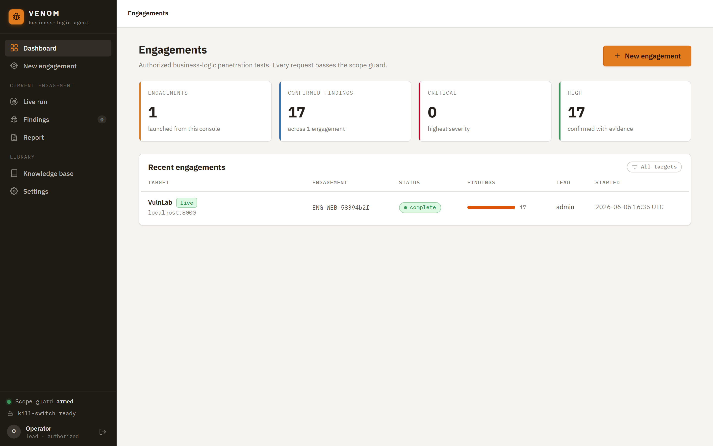
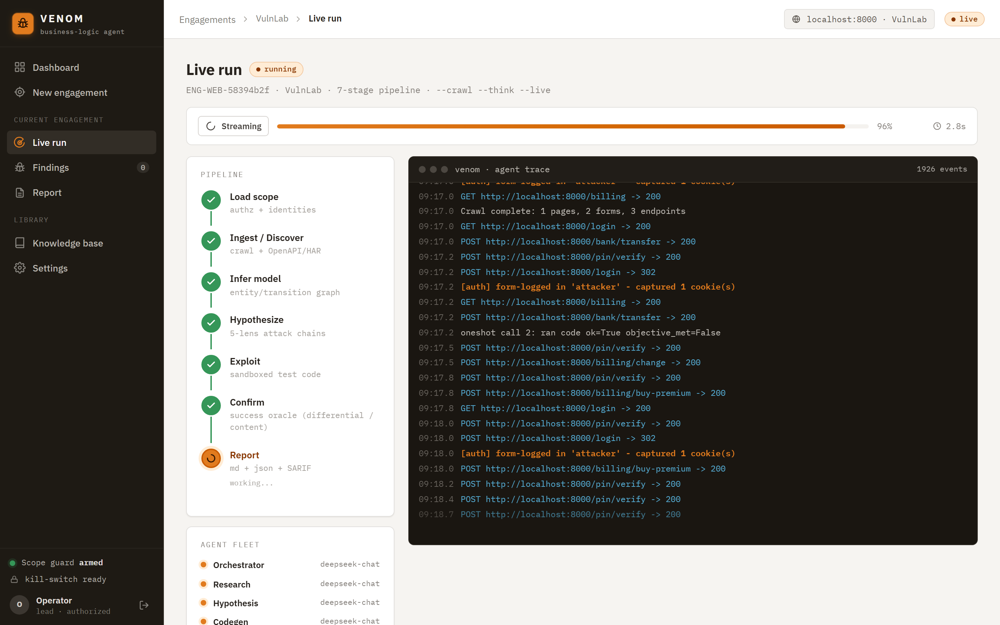
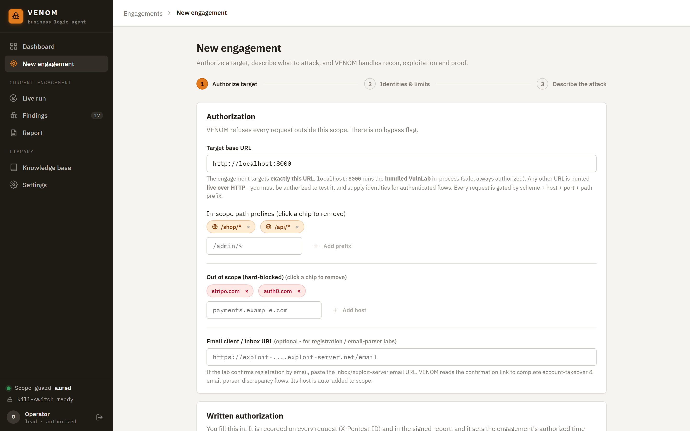
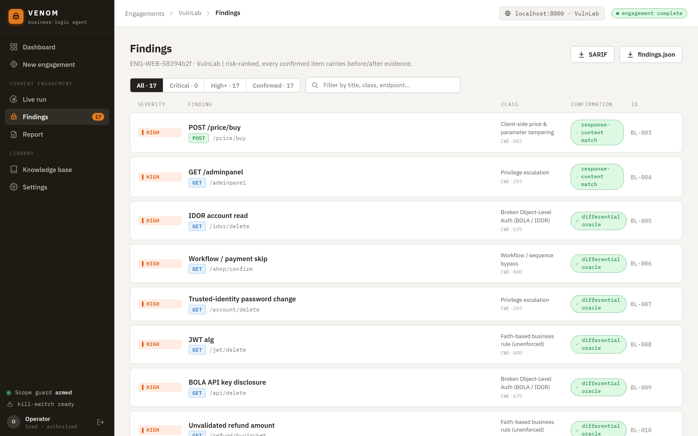
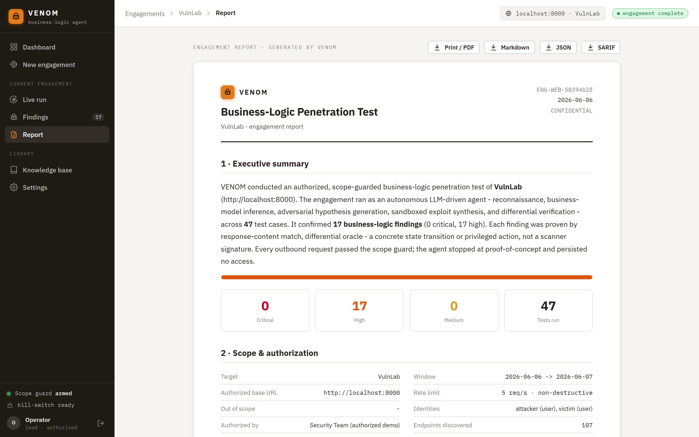
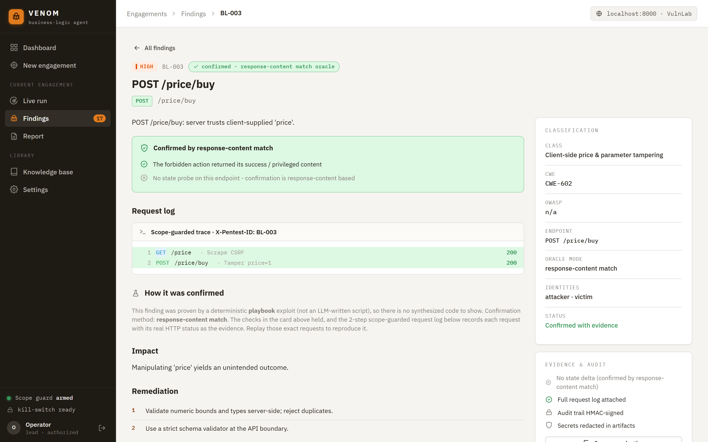

# 🕷️ VENOM

**Context-aware business-logic penetration testing agent.** VENOM reconstructs
how an application is *supposed* to work, then systematically attacks every
assumption that model rests on:
sequence violations, BOLA/IDOR, race conditions, parameter/type confusion,
mass-assignment privilege escalation, and economic-flow abuse.

> ⚠️ **Authorized engagements only.** VENOM loads an authorization *scope object*
> before any action and refuses to send a single request outside it. There is no
> bypass flag. Testing any target without explicit written authorization is
> illegal and unsupported.

## The console

A login-gated, multi-operator web console (`venom web`) drives the **same engine**
as the CLI — a live agent trace, evidence-backed findings, and Markdown/JSON/SARIF
export. Light & dark themes, four brand accents, comfortable/compact density.

| Engagement dashboard | Live, scope-guarded scan |
|---|---|
|  |  |
| Severity-graded stats, scope-guard / kill-switch status, per-operator runs. | The 7-stage pipeline + the **real** streaming agent trace (recon → infer → hypothesize → exploit → verify). |

**Authorize first — there is no bypass flag.** Every engagement begins from a scope:
in-scope path prefixes, hard-blocked hosts, written authorization, and login identities.



**Evidence-backed findings & report.** Each finding states *how* it was proven —
differential oracle vs. response-content match — and carries the scope-guarded
request log, HMAC-signed audit, and redacted artifacts. Export Markdown / JSON / SARIF.

| Risk-ranked findings | Enterprise report |
|---|---|
|  |  |



<sub>The console also ships a dark theme; see [`docs/web-console.md`](docs/web-console.md) for all screens and theming.</sub>

## Documentation

The full reference lives in [`docs/`](docs/):

- [Getting started](docs/getting-started.md) · [Architecture](docs/architecture.md) · [CLI](docs/cli.md) · [Configuration](docs/configuration.md)
- [Success oracle](docs/success-oracle.md) (how a win is decided) · [Web console](docs/web-console.md) (login, screens, theming)
- [Security model](docs/security.md) · [Configuration](docs/configuration.md)
- [**Capabilities & limits**](docs/capabilities-and-limits.md) - the honest assessment: what is proven vs. model-limited, with real eval numbers

---

## Pipeline

```
load scope ─► ingest / DISCOVER ─► infer model ─► generate ────► execute ──────────► confirm ─────► report
  (authz +    OpenAPI/GraphQL/HAR/   LLM fleet or   concrete        authenticated,      state-delta /  md+json+
  identities) Burp/JS  +  crawler    heuristic      exploits + RAG  provisioned, burst  HTML/reflect   SARIF+audit
```

## Two target modes: JSON APIs **and** classic web apps

VENOM is not JSON-only. It handles both:

- **API mode** - OpenAPI/GraphQL/HAR artifacts, JSON bodies, bearer/JSON-token login, JSONPath confirmation.
- **Web-app mode** - point it at a URL and it **crawls to discover** forms/links/params (no artifacts needed), logs in via **HTML form + CSRF + session cookie**, sends **form-encoded** requests, and **confirms from HTML** (response text, reflected fields, before/after state). A bundled forced-browse wordlist (`venom/data/wordlists/common.txt`, shipped in Docker) surfaces hidden/privileged pages.

```bash
# Point-and-shoot against a live web app (no artifacts):
venom run --scope scope.json --crawl --live
```

Web-app business-logic classes covered: client-side trust / price & parameter
tampering, web IDOR (cross-account), and broken access control (forced browsing).
Proven end-to-end against an in-memory vulnerable HTML shop in
`tests/test_web_app.py` (discovery -> form login -> confirm).

Every outbound request passes through `Scope.assert_request_allowed()` and a
token-bucket rate limiter, and carries `X-Pentest-ID: <engagement_id>` so the
target's blue team can filter test traffic.

## Autonomous reasoning engine - beyond playbooks

Playbooks are fast and deterministic, but they can only do what's coded. For
flaws nobody pre-wrote, VENOM has an **autonomous engine**
([`venom/cognition/`](venom/cognition/)) that writes and runs **real exploit
code** against the discovered surface. Two entry points share the same machinery:

- **`oneshot`** - LLM-frugal (default ≤3 model calls): recon -> one synthesis ->
  sandboxed exploit -> verify. Built to survive rate-limited or slow models.
- **`hunt`** - the iterative agent loop: observe -> act -> read the real response ->
  re-think, one step at a time, with backtracking and call caps.

```
observe -> recon (accessible / denied map + auto-loot) -> SYNTHESIZE exploit -> run in sandbox -> VERIFY
```

**Active recon / auto-loot.** Before synthesis, VENOM probes the surface as the
current user and builds the senior-tester *accessible / denied* map. It also
**enumerates object-id parameters** (e.g. `?id=`, `?mrn=`, `?org=`) with a small
privileged-value sweep and **harvests any secrets** a BOLA/IDOR read leaks
(tokens, api-keys, pins, invites), surfacing them - together with the exact custom
auth header named on the page - so the exploit can reuse them directly instead of
re-deriving them. The object-id enumeration and secret-harvesting are **read-only
(GET)**; the accessible/denied probe sends *empty-body* requests whose only purpose
is to read the authorization gate, and destructive methods (DELETE/PUT/PATCH) are
scope-gated. The privileged action that meets the objective is still the exploit's job.

The model is given the discovered surface plus a **business-logic knowledge base**
([`venom/knowledge/`](venom/knowledge/), 20 classes from OWASP WSTG, the OWASP API
Top-10, and PortSwigger) as *priors*, **ranked to the target** so it anchors on
what the app actually exposes. It then emits a fenced `async def exploit(http): ...`
block (fenced code, not JSON-embedded - far more reliable for smaller models).

**Sandboxed, action-grounded execution.** Agent-authored code runs in a guarded
sandbox ([`venom/tools/base.py`](venom/tools/base.py)): AST-validated, restricted
builtins with a **pure-stdlib import whitelist** (no `os`/`sys`/`subprocess`/
`socket`), a hard wall-clock timeout, and **action grounding** - any call to an
endpoint that was *not* discovered during recon is refused, so the model cannot
hallucinate paths. The exploit is handed ready-made helpers: `login()` for
in-session re-authentication, and technique primitives (`extract`,
`find_overflow_qty`, `modinv`, `brute`) from
[`venom/tools/exploit_kit.py`](venom/tools/exploit_kit.py). Every failed attempt
feeds back the **real HTTP responses it observed**, so retries are directed rather
than blind.

```bash
venom oneshot https://app.example.com --objective "..."   # frugal (≤3 calls)
venom hunt    https://app.example.com                   # iterative agent
```

All LLM input is **budget-trimmed** ([`venom/llm/budget.py`](venom/llm/budget.py))
and HTML is compacted to its form/link/text skeleton, so VENOM stays within
free-tier context limits.

> Honest scope: the engine *architecture* - recon depth, action grounding, the
> sandbox, and the success oracle - is fully tested and proven. Whether it cracks a
> given novel flaw still depends on the model's reasoning. Playbooks remain the
> reliable path for known classes, and both run together.

### Live validation (DeepSeek V4, 2026-06)

Run server-less against the bundled VulnLab (Vulnerable Labs) on the **DeepSeek API**, the autonomous
`oneshot` hunt (per-lab budget 4) scored, on a 10-lab representative subset spanning
distinct flaw classes:

| Model | Solved | Labs proven |
|---|---|---|
| `deepseek-v4-flash` (fast, `deepseek-chat`) | **6 / 10** | bola, coupon, idor, jwt, trustid, workflow |
| `deepseek-v4-pro` (reasoner) | **5 / 10** | bola, idor, jwt, money, trustid |

Honest read: the reasoner was **not** uniformly stronger here — it uniquely cracked
the hard `money` (infinite-money) lab but missed `coupon`/`workflow`; both missed
`price`/`mass`/`io`. A full web-console engagement against the combined 37-lab
surface confirmed **17 HIGH findings across 47 test cases** (the report screenshot
above). These are real `oneshot` / coverage runs, not estimates. The full
enterprise-readiness audit and every fix it drove are in
[`docs/AUDIT-2026-06.md`](docs/AUDIT-2026-06.md).

## How "success" is decided - the differential oracle

Real business-logic wins are *state transitions*, not success banners. VENOM's
oracle ([`venom/cognition/objective.py`](venom/cognition/objective.py)) decides a
win in strict priority:

1. **Differential (preferred, app-agnostic):** a concrete win action that is
   **denied** for the un-escalated user (baseline) and **succeeds** after the
   exploit - no product-specific string required. (When the privilege is carried
   *in* the winning request - e.g. a stolen token in a BOLA delete - the oracle
   also accepts the win action succeeding inside the exploit's own request trace,
   still gated on the baseline having been denied.)
2. **Operator-defined marker:** a `success_text` / `win_signals` substring, active
   **only** when the operator explicitly sets it.
3. **Neither -> an honest "unknown"** (`False`). VENOM never infers success from a
   baked-in banner, so results carry over to real enterprise apps that have none.

## Proven by tests, honest about limits

The engine's safety and contract are covered by the shipped test suite (scope guard,
the oracle's string-free contract, action grounding, the sandbox, redaction, the audit
trail, and the multi-user console). Whether the autonomous engine cracks a *specific*
novel flaw depends on the reasoning model, not the harness. See
[docs/capabilities-and-limits.md](docs/capabilities-and-limits.md) for the honest read on
what is proven versus what is model-limited.

## Multi-agent fleet

The reasoning stages are driven by a fleet of agents. By default they all run on
the **DeepSeek** API (paid, OpenAI-compatible) - `deepseek-chat` (V3) is fast and
strong at code synthesis:

| Agent | Default model | Job |
|-------|---------------|-----|
| **Orchestrator** (main) | `deepseek-chat` | Planning, business-model synthesis, coordination |
| **Research** | `deepseek-chat` | Domain-doc analysis, similar-vuln recall |
| **Hypothesis** | `deepseek-chat` | Adversarial attack-chain generation (5 lenses) |
| **CodeGen** | `deepseek-chat` | Synthesize concrete exploit code (drives `oneshot`) |
| **Summarizer** | `deepseek-chat` | Cheap, high-volume result summaries |
| **Reporter** | `deepseek-chat` | Final report prose |

**Where to select models:** in `.env`, via `VENOM_MODEL_<ROLE>` (see
`.env.template`). Upgrade reasoning-heavy roles to `deepseek-reasoner` (R1) for
deeper (slower) reasoning. `venom agents` prints the live mapping. If no provider
key is set and air-gap is off, VENOM drops to the deterministic **offline**
pipeline automatically.

The router also supports **NVIDIA NIM**, **OpenRouter**, and **local / cloud
Ollama** models (e.g. `gemma4:31b`, `qwen2.5-coder`) as automatic fallbacks
(DeepSeek -> NVIDIA -> OpenRouter -> Ollama). Set `LLM_AIR_GAP=true` to force
Ollama-only for air-gapped engagements.

## Install

```powershell
cd D:\MANTIS
py -m venv .venv; .\.venv\Scripts\Activate.ps1
pip install -e .
copy .env.template .env   # then edit .env (optional - runs offline without keys)
```

No LLM keys? VENOM runs in **offline mode**: deterministic playbook generation
and a heuristic business model. Add a `DEEPSEEK_API_KEY` (the paid primary; or
`NVIDIA_API_KEY` / `OPENROUTER_API_KEY`, or a local/cloud Ollama endpoint) to
enable LLM rule inference, adversarial hypotheses, and the autonomous
`oneshot` / `hunt` engine.

## Usage

```powershell
# 1. Validate an engagement scope
venom scope --scope examples\scope.json

# 2. Ingest artifacts and inspect the endpoint registry (risk-ranked)
venom ingest --in examples\

# 3. Check providers / the multi-agent model fleet
venom providers
venom agents            # show role -> model mapping
venom agents --ping     # live-test each NVIDIA NIM model
venom burp --status     # check the local Burp MCP endpoint

# 4. Full engagement - DRY-RUN by default (sends nothing)
venom run --scope examples\scope.json --in examples\ --out venom_data\reports\eng-001

# 5. Execute for real (only inside the authorized window; guard still applies)
venom run --scope examples\scope.json --in examples\ --live

# 6. Autonomous engine against a live, authorized URL (URL is positional)
venom oneshot https://app.example.com --objective "delete another user's account"
venom hunt    https://app.example.com --login wiener:peter   # iterative agent loop
```

Outputs land in the `--out` directory:
- `report.md` - executive summary, scope, findings, full test appendix
- `findings.json` - machine-readable findings + every test case
- `business_model.json` - the reconstructed entity/transition/rule/actor graph

## Web console

A local web UI over the real engine - the same scope guard, engine and findings,
in a browser. It requires **login** (multi-user; each operator sees only their own
engagements). Launching an engagement runs a **real**, scope-guarded `run_engagement`
against the authorized target URL you enter; the live agent trace streams over SSE and
the Findings/Report screens render the actual `findings.json` it produces.

> An **LLM provider is required** (e.g. `DEEPSEEK_API_KEY` in `.env`): the live
> hunt reasons about the target with a model (recon -> infer -> hypothesize ->
> exploit -> verify) and **fails closed** with a clear error if none is configured -
> VENOM will not fabricate a hunt or silently degrade to a status-code scanner.

```powershell
venom web --open                 # serves http://127.0.0.1:8080 and opens a browser
venom web --host 0.0.0.0 --port 8080
```

Screens: Dashboard (your real runs + a labelled demo engagement), New engagement
wizard (validates scope, then launches), Live run (streamed pipeline + console),
Findings + detail (request log, state-delta, sandboxed exploit, remediation),
Report, Knowledge base and Settings (live provider + agent-fleet status). The UI
loads React from a CDN, so first paint needs internet; fonts fall back to
`system-ui`.

## Authenticated, multi-actor testing (identities)

Business-logic flaws live in *authenticated, stateful, multi-actor* flows, so the
scope carries **identities**. VENOM logs each in (capturing tokens/cookies),
keeps isolated sessions, and auto re-logins + retries once on 401/403:

```json
"identities": [
  {"name": "attacker", "role": "free_user", "auth": {
     "type": "login", "method": "POST", "path": "/api/v1/login",
     "body": {"username": "a@x.com", "password": "..."},
     "token_path": "$.access_token", "place": "header",
     "header": "Authorization", "scheme": "Bearer"}},
  {"name": "victim", "role": "premium_user", "auth": {"type": "login", "...": "..."}}
]
```

Auth types: `login` (recommended), `bearer`, `cookie`, `basic`.

## How findings are confirmed (not just attempted)

Each test case can carry **provisioning** (`setup_steps`, often run as the victim
to create a real target object), and a **state probe** (a GET run *before and
after* the attack). The runner exposes `*_before`, `*_after`, `*_delta`, and
`net_balance_delta` to each step's `success_condition`, so confirmation is
grounded in actual state change, e.g.:

- **IDOR** - victim provisions an object; attacker reads it -> confirmed on `status == 200 and bool(body)`.
- **Race** - a true concurrency *burst* (rate-limiter bypassed) drives a wallet
  balance below zero -> confirmed on `results_2xx > 1 and balance_after < 0`, not a 2xx count.
- **Mass assignment** - confirmed only when the server **reflects** an injected
  privileged field (`body.get('role') == 'admin'`).
- **Sequence bypass** - terminal transition (refund) succeeds without its precondition.

Every confirmed finding carries evidence: the before/after state, deltas, and a
request log. A full end-to-end proof against an in-memory vulnerable API lives in
`tests/test_integration_vuln_app.py`.

## RAG prior-art corpus

Hypotheses and findings are augmented with similar real-world writeups via a
built-in TF-IDF corpus (`venom/rag/`) - no heavy deps. Extend it at
`VENOM_DATA_DIR/rag/corpus.json`.

## Scope object

Saved as `venom_data/engagements/<id>/scope.json` (see `examples/scope.json`):

```json
{
  "engagement_id": "ENG-2026-001",
  "target_name": "AcmePay",
  "authorized_base_urls": ["https://api-staging.acmepay.example.com"],
  "out_of_scope": ["stripe.com", "auth0.com"],
  "rate_limit_per_second": 5,
  "allow_destructive": false,
  "authorized_by": "Jane Smith, CISO",
  "authorization_date": "2026-06-01T00:00:00Z",
  "expiry_date": "2026-06-30T23:59:59Z"
}
```

`authorized_base_urls` gate by scheme + host + port + path prefix. Requests
outside that set, to anything in `out_of_scope`, after `expiry_date`, or
destructive methods without `allow_destructive`, are blocked at the HTTP layer.

## Package layout

```
venom/
  config.py            Settings from .env (+ always-on secret redaction filter)
  llm/providers.py     Multi-provider router (DeepSeek / NVIDIA NIM / OpenRouter / Ollama, fallback)
  agents/              Multi-agent fleet: roles, Agent, Orchestrator
  cognition/           Autonomous engine: oneshot (frugal) + iterative agent + the
                         differential success oracle (objective.py)
  tools/               Scope-guarded toolbox + sandboxed run_exploit_code (action
                         grounding, AST validation) + exploit_kit technique primitives
  knowledge/           Business-logic KB (20 classes) + surface-ranked priors
  integrations/        Keyless Burp Suite MCP client (loopback SSE)
  core/
    scope.py           Authorization guard (the safety boundary)
    registry.py        Unified endpoint registry + risk tiering
    graph.py           Business model graph (entities/transitions/rules/actors)
  ingest/              OpenAPI, GraphQL, HAR, Burp XML, JS bundles + live crawler + recon
  inference/           LLM rule inference + adversarial hypothesis generation
  flows/               Deterministic PortSwigger-lab solvers (separate from the engine)
  rag/                 Writeup corpus + TF-IDF retriever (prior-art augmentation)
  testing/             Schema, API playbooks, web-app playbooks, generator
  engine/              Scope-guarded client + auth/identities + state-delta runner
  report/              Findings + evidence + Markdown/JSON/SARIF + audit trail
  audit.py             HMAC-signed, tamper-evident audit trail + run metrics
  data/wordlists/      Bundled forced-browse wordlist (packaged into Docker)
  utils.py             JSONPath, HTML extract, PII redaction, sandboxed eval
  prompts/             Bundled VENOM master system prompt
  web/                 Web console: std-lib HTTP server + JSON API + SSE + auth + UI
  engagement.py        End-to-end orchestrator
  cli.py               Command-line interface
scripts/
  setup_burp.* run_*   Burp + MCP download/run scripts (PowerShell + bash)
```

```
## Docker

A multi-stage, **non-root** image is provided. `docker compose up` launches the
web console; the CLI and a local Ollama backend are opt-in (see [Compose](#compose) below).

```bash
# Build the image
docker build -t venom-agent:0.1.0 .

# The container IS the `venom` CLI - append subcommands:
docker run --rm venom-agent:0.1.0 scope --scope examples/scope.json
docker run --rm -v "$PWD/venom_data:/data" venom-agent:0.1.0 \
    run --scope examples/scope.json --in examples/ --out /data/reports/eng-001
```

### Compose

`docker compose up` starts the web console:

```bash
cp .env.template .env                         # set DEEPSEEK_API_KEY etc. (see configuration)
docker compose up --build                     # -> console http://localhost:8080
```

The one-shot CLI is also available:

```bash
docker compose run --rm venom scope --scope examples/scope.json
docker compose run --rm venom run   --scope examples/scope.json --in examples/
docker compose run --rm venom hunt https://app.example.com    # an authorized target
```

Drop your own engagement files into `./engagements/` (bind-mounted read-only at
`/engagements`) and reports land in `./venom_data/`.
```

### Local / air-gapped LLM (Ollama)

```bash
docker compose --profile local up -d ollama
docker compose exec ollama ollama pull llama3.1:8b
# In .env set LLM_AIR_GAP=true (or air_gap_mode in the scope) to route all
# inference to the local model - nothing leaves the network.
docker compose --profile local run --rm venom providers
```

The Compose file wires `OLLAMA_BASE_URL` to the `ollama` service automatically.
Uncomment the `deploy.resources` block in `docker-compose.yml` for GPU inference.

## Burp Suite MCP (keyless, local)

**No API key.** The PortSwigger "MCP Server" extension runs inside Burp on your
machine and exposes a loopback SSE endpoint; VENOM speaks MCP to it over
`127.0.0.1`. Provisioning scripts make it available before you run:

```powershell
pwsh scripts/setup_burp.ps1      # download Burp + the MCP extension into ./tools/burp
pwsh scripts/run_burp_mcp.ps1    # launch Burp with the extension auto-loaded
```

```bash
scripts/setup_burp.sh            # bash equivalents
scripts/run_burp_mcp.sh
scripts/setup_burp.sh --check    # verify what's installed, download nothing
```

Then in `.env` set `BURP_MCP_ENABLED=true`, install the client SDK with
`pip install "venom-agent[burp]"`, and verify with `venom burp --status`.
When Burp isn't running, VENOM falls back to `httpx` execution and exportable
artifacts - the engagement still runs.

> Burp needs a Java 17+ runtime. The Community jar works for traffic/Repeater;
> some MCP tools (active scan, Intruder throttling) require Burp Pro.

## Tests

The test suite is the proof of correctness - real behaviour, not stubs.

```powershell
pip install pytest pytest-asyncio
pytest                                   # full suite (asyncio_mode=auto)
pytest tests/test_tools.py               # action grounding + the oracle's string-free contract
pytest tests/test_exploit_sandbox.py     # the sandbox (imports, format-string escape) + helpers
pytest tests/test_web_auth.py            # console auth + per-user isolation
```

The differential oracle is asserted to never confirm a win from a baked-in banner.
Opt-in live-LLM tests are gated by `VENOM_LIVE_LLM=1` (skipped by default). A separate,
internal development suite drives the engine against a deliberately-vulnerable lab; that
lab is not shipped here, and those suites skip automatically when it is absent, so a
clone stays green.

## Safety model (non-negotiable)

- No request leaves the process without passing the scope guard.
- `run` is **dry-run by default**; real traffic requires explicit `--live`.
- Rate limiting is enforced per the scope's `rate_limit_per_second`.
- Destructive methods require `allow_destructive: true`.
- Observed secrets in artifacts are redacted, never printed in full.
- The agent stops at proof-of-concept; it never persists access or destroys data.
